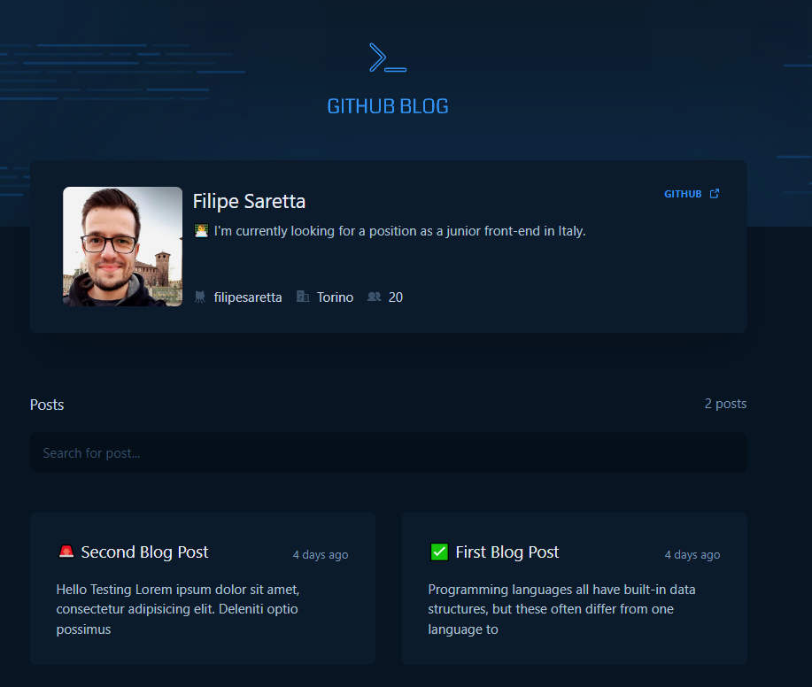

<h1 align="center">Issue Based Github Blog</h1>

<p align="center">
  <a href="#tech">Tech</a>&nbsp;&nbsp;&nbsp;|&nbsp;&nbsp;&nbsp;
  <a href="#project">Projeto</a>&nbsp;&nbsp;&nbsp;|&nbsp;&nbsp;&nbsp;
  <a href="#getting-started">Getting Started</a>
</p>

## Project

Project Live here: https://filipe-github-blog.vercel.app/



## Tech

- React
- Typescript
- Tailwind

## Getting Started

Clone the project and access the folder.

```
git clone https://github.com/filipesaretta/filipe-github-blog

cd filipe-github-blog
```

Install the dependencies and start.

```
npm install

npm run dev
```

## About Project 

The challenge was to build a blog based on the issues of a repository using the github API to fetch the data. I took the opportunity to use tailwind to make the styles what made the work flow much faster.